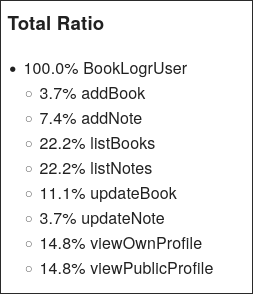
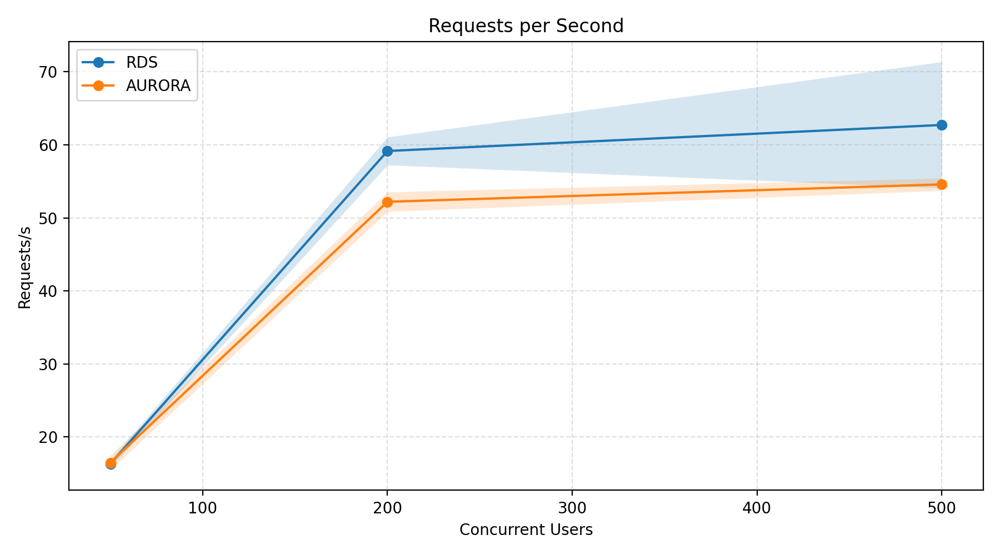
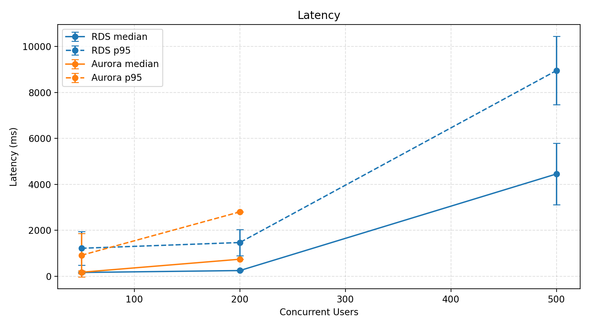
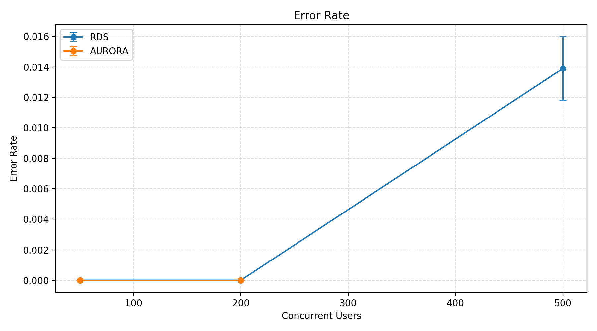
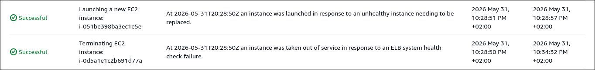

# Introduction

This project aims to design and deploy a scalable cloud-based application that allows users to maintain a personal library of books they have read and submit reviews for them. The application is inspired by platforms like Goodreads, that allow user to track their reading progress, give ratings to books, and share their library with friends. The main goal of this project is to evaluate the performance and cost-efficiency of the system under different levels of user traffic, and to compare the performance of two different database solutions - Amazon RDS for PostgreSQL and Amazon Aurora.

I created a [GitHub repository for this project](https://github.com/Pederrr/aws-clouds-project.git), which contains all the needed code, CloudFormation templates, documentation for deploying the application, and various scripts for load testing purposes. The repository also contains the results of the load testing, and script for plotting the results.

## Questions

I formulated the two main question I want to answer through this project:

- Q1 (Comparative Performance): Does Amazon Aurora provide a statistically significant improvement in transaction throughput and latency for CRUD operations compared to standard Amazon RDS PostgreSQL?
- Q2 (Cost-Efficiency): Which database engine offers a better Performance-per-Dollar ratio under comparable load conditions?

# Architecture of the project

I used the knowledge gained in the AWS Academy Cloud Foundations and AWS Academy Cloud Achitecting courses accessible on the [awsacademy platform](https://awsacademy.instructure.com), and lectures of this course. Another valuable source of information and inspiration for the architecture design was the [AWS documentation](https://docs.aws.amazon.com/) which provides best practices and guidelines. I was using this [documentation](https://docs.aws.amazon.com/cloudformation/) mainly when creating the CloudFormation templates, as it provides good examples and explanations of the different options and settings.

## Application

I used an Open Source application called [Booklogr](https://github.com/Mozzo1000/booklogr), which is a self-hosted service for tracking personal library of users. It allows the users to add books to their library, track reading progress, give ratings to books, and share their library with friends. The application is consists of frontend and backend parts.

The frontend is a single page application built in React, while the backend is an application built in Python using Flash framework. The backend provides a REST API for the fronted, and interacts with a database. The application supports SQLite and PostgreSQL databases. The backend also provides user authentication and authorization, allowing users to create accounts and manage their libraries securely. The backend can be easily deployed using Docker.

## Infrastructure design

### VPC and security groups

The backend and DB of Booklogr are deployed in a custom VPC with public and private subnets. There are two public and two private subnets across two availability zones. The public subnets are used for hosting the backend and the load balancer, while the private subnets are used for hosting the database. Deploying servers in public subnets is not the best practice for production environments, but it allows me to not use NAT gateways, which is one of the more expensive AWS services. So this is a cost saving measure for this project.

I created three security groups for the application. The first security group is for the load balancer, which allows incoming traffic on port 80 from the Internet. The second security group is for the API servers, which allows incoming traffic on port 80 from the lead balancer security group. I also allowed ssh access from the Internet for easier debugging during the development, but this can be easily removed in the CloudFormation template. The third security group is for the database, which allows incoming traffic on port 5432 (PostgreSQL) from the API server security group.

### Database

I used RDS with PostgreSQL engine, and Aurora with PostgreSQL compatibility. Both databases use the same instance type, db.t3.medium, as this is the biggest instance type allowed in our lab environment, and also the smallest instance type allowed for Aurora usage. The database is deployed in a private subnet, with security group allowing incoming traffic only on port 5432 from the API server security group.

I deployed the database in a single availability zone, which is not recommended for production environments, but it is a cost-saving measure for this project, as the main goal is to compare the performance, and not the availability of the database. The cost of deploying the database in multi-AZ is significantly higher, as it requires running two instances of the database, and also incurs additional costs for data transfer between the availability zones. Setting up multi-AZ deployment would however be a good and easy improvement for the future. It is possible to enable this by just changing one setting in the AWS console, or in the provided CloudFormation template.

I provided the DB credentials through parameters in the CloudFormation template, which is not the best practice for production environments, but it is a simple solution for this project. A better solution would be to use AWS Secrets Manager. This would add an extra layer of security, but would bring additional costs.

### API servers

The backend is hosted on EC2 instances in an autoscaling group behind an Application Load Balancer. The autoscaling group is configured to maintain a minimum of 2 instances, and a configurable maximum number of instances. The autoscaling group is configured to adjust the number of instances based on the average CPU utilization of the instances.

To simplify the deployment, I used Docker containers for the backend. This allows me to just pull the image on the EC2 instance, and not copy the whole code and set up the whole environment for running the app. Using ECS would be a better solution for hosting the backend, but I had issues with corretly setting up the IAM roles needed for running ECS tasks in the lab environment. I decide that running the containers on EC2 instances is a good enough solution. 

Since I am not using ECS, I decided to create a custom AMI for the EC2 instances in the autoscaling group, which has docker pre-installed and the backend docker image already pulled. This way, when a new instance is launched by the autoscaling group, it has everything already installed, and it can just start the docker container with the API server. I wanted to use EC2 Image Builder in a separate CloudFormation template to automate the creation of the custom AMI, but the lab environment does not allow us to use this service. Therefore, I created the custom image manually. I created a temporary EC2 instance with the following user data script, which installs docker and pulls the backend image:
```
#!/bin/bash
yum install docker -y
systemctl enable docker
systemctl start docker
docker pull mozzo/booklogr:v1.10.0
```
I then created an AMI from this instance, and used this AMI in the launch template for my autoscaling group.

### Frontend deployment

The frontend is a single page application (SPA), which means that it is just a collection of static JavaScript files. Therefore, I decided to host the frontend on an S3 bucket, which is a very cost-effective solution. 

My original plan was to host add CloudFront distribution in front of the S3 bucket, which would allow me to take advantage of the CDN capabilities of CloudFront, and also keep the bucket private, while allowing access only from CloudFront. I successfully deployed the app this way in the sandbox environment. However, when I tried to move to the lab environment, I realized that we do not have permissions to create CloudFront distributions. Therefore, the frontend SPA is served directly from public S3 bucket, using the static website hosting feature of S3.

The fronted is the component directly accessed by the users, and it is responsible for displaying the UI and making requests to the backend API. So, the user accesses the app through the S3 bucket static website hosting URL, and the UI is displayed in his browser. The frontend then makes requests to the backend API through the load balancer URL, which is configured in the frontend code before it is built and uploaded to the S3 bucket. The fronted then updates the UI based on the responses from the backend API.

## Deployment automation

I used CloudFormation templates for automating the deployment of the infrastructure. I created separate templates for each component of the infrastructure. The details can be seen in the `templates` directory of the project repository. By using the templates, I was able to easily deploy and remove the infrastructure. This was especially useful during the load testing phase, as I was able to quickly replace the RDS instance with the Aurora database.

## Challenges and encountered issues

### Cross-origin resource sharing (CORS)

The frontend and backend of the application are served from different domains (S3 bucket, Load balancer), which causes cross-origin resource sharing (CORS) issues when the frontend tries to make requests to the backend API. CORS is a security feature that blocks requests from one domain to another domain unless the server explicitly allows it, as described in [mozzila documentation](https://developer.mozilla.org/en-US/docs/Web/HTTP/Guides/CORS)

As I mentioned before, at first I was using CloudFront to serve the frontend. I found multiple solutions proposing to solve the CORS issues by adding a custom origin in the CloudFront distribution that points to the backend API (or load balancer in our case). So for example, the frontend would be accessible by `https://<cloudfront-domain>/`, and the backend API would be accessible by `https://<cloudfront-domain>/api/`. This way, both the frontend and backend are served from the same domain, and CORS issues are avoided. I deployed the app using this solution in the sandbox environment, and it worked correctly. I also tweaked the security group of the load balancer to allow incoming traffic only from the CloudFront distribution, which adds another extra layer of security, as the backend API is not directly accessible from the Internet, and CloudFront can also provide some additional security features.

However, when I realized we cannot use CloudFront in the lab environment, I had to find another solution for the CORS issues. I solved this issue by configuring the application load balancer to add the necessary CORS headers to the responses from the backend. I also had to create a special fixed response in the load balancer to handle the preflight OPTIONS requests. The details can be seen in the CloudFormation template for the load balancer deployment `templates/4_load_balancer.yaml`.

### CloudFormation templates

I did not write the templates from scratch, but I first deployed the infrastructure manually through the AWS console, and then used the AWS CloudFormation IaC Generator to generate the templates from existing resources. However, I found that the generated templates were quite hard to read and understand, since they missed some needed resources, contained lot of unnecessary options, and hard-coded resource IDs. I tried to modify and cleanup the generated templates, but I found it too time-consuming and error-prone.

Later, I discovered the [Former2](https://former2.com/) tool, which is an open source web-based tool for generating IaC templates from existing AWS resources. This tool generated much cleaner templates which were much easier to modify and reuse. They also did not contain hard-coded resource IDs, but instead used CloudFormation functions to reference the resources.
This made the templates easier to understand and modify. I used the generated templates as a base, and then modified them to fit my needs. I also split the one big generated template into multiple smaller templates for each component of the infrastructure. This way, I do not need to e.g. redeploy the VPC, S3 bucket, and Load Balancer every time I decide I need to redeploy the database, which saves time. The details of the templates can be seen in the `templates` directory of the project repository.

### Random error 500 when opening book detail page

I noticed that sometimes, when I open the book detail page, I get a notification saying: "Request failed with status code 500". It is important to note, that the error is present even when running the application locally using docker compose, therefore this is not related to the app running in AWS, but it is a bug in the application code itself.

This error is caused by the fronted making a request to the /v1/<book-id>/sessions. However, the book id in this case is "undefined". However, the frontend does request to /v1/<book-id>/status right after that, and this request works correctly. This looks like a race condition in the frontend code, where some component is loaded and trying to make a request before the book id is properly loaded. My React knowledge is quite limited, so I was not able to find and fix the issue, even when using AI tools (Claude code). This is however not a critical issue, and it does not affect the overall functionality of the application. I decided to not spend more time on debugging this issue.

## Potential improvements of the architecture

I already mentioned and explained some potential improvements that were not implemented due to the limitations of the lab environment or due to cost saving measures. These include:

- Using CloudFront to host the frontend
- Using ECS for the backend
- Using EC2 Image Builder for automating the creation of the custom AMI for backend deployment
- Deploying the backend in private subnets, and using NAT gateway for allowing the backend to access the Internet
- Using AWS Secrets Manager for storing the database credentials

The next sections discuss some other potential improvements that I identified.

### Caching of images from Open Library API

The application uses the Open Library API to fetch book information and book covers directly from the frontend. This means that every time a user lists a book, the frontend makes a request to external API to fetch the book cover. This is not very efficient, as it adds latency to the application, and also puts unnecessary load on the external API. A better solution would be to fetch the book information and book covers in the backend, and then cache the results in S3 bucket or similar storage. This way, the frontend can just request the book information and book covers from the backend, which would be faster, and also reduce the load on the external API. This would require significant changes to the backend code, but it would improve the performance of the application, and also provide a better user experience.

### SSL certificate for Load Balancer

Currently, the Load Balancer is communicating using HTTP, which is not secure. It would be better to use the application over HTTPS, which would provide encryption of data in transit. This would improve the security of the application.

### OIDC authentication

I used the application's built-in authentication and authorization system, which is based on email and password. However, the application also supports OIDC authentication, which allows users to authenticate using their existing accounts from other identity providers. It would be interesting to set up OIDC authentication using the AWS Cognito service, which would allow users to authenticate using their existing AWS accounts. This would also allow me to take advantage of the security features of AWS Cognito, such as multi-factor authentication and user management. This would be a good next step for improving the security, especially when the application already supports OIDC. 

### DB clusters with read replicas

The application is currently using a single instance of the database, which means that all the read and write operations are handled by the same instance. This can become a bottleneck when the load increases, as the database may struggle to handle all the requests. A better solution would be to use a database cluster with read replicas, which would allow me to distribute the read operations across multiple instances, while still having a single instance handling the write operations. This would maybe improve the performance of the application under load, and also provide better scalability. Both RDS and Aurora support this feature, so it would be interesting to test and compare the performance of both solutions with this setup. This would require significant changes to the backend code, as the backend would need to be modified to use two different database endpoints - one for read operations, and one for write operations. This would also increase the cost of running the application, as it would require running multiple instances of the database.

# Experiments

I used [locust](https://locust.io/) tool for load testing the application backend. I created a custom locust file that simulates users interacting with the API - logging in, listing books, adding, updating, and removing data about books and notes. The ratio of the different operation types reported by the locust tool:



I ran the test in multiple configurations, with different number of concurrent users and with both PostgreSQL RDS and Aurora databases:

| Database | Number of concurrent users | Duration |
| --- | --- | --- |
| PostgreSQL RDS | 50 | 10 minutes |
| PostgreSQL RDS | 200 | 12 minutes |
| PostgreSQL RDS | 500 | 15 minutes |
| Aurora | 50 | 10 minutes |
| Aurora | 200 | 12 minutes |
| Aurora | 500 | 15 minutes |


Each test combination was repeated three times to get more accurate results, and to see if there are any significant differences between the runs. The tests were run with the same configuration of the resources used in the application. The database was always initialized with the same data before each test run. The tests for 500 concurrent users were sadly only ran twice, as the lab environment was not accessible for me after the second run, and I was not able to run the tests again.

I then looked at different metrics during the load tests:

- RPS (requests per second) the system handles
- Average response time (Latency) of the API requests
- Error rate of the API requests

At the end, I estimated the cost of running the application under the given load using the AWS Pricing Calculator.

## Seeding the database

I wanted to ensure consistent starting state for each load test, so that I can compare the results of the tests more accurately. To achieve this, I vibecoded a small python script that uses the backend API to seed the database with data. The script creates 1000 users, with 10 books and in their library, with notes for each book. The script also generates CSV file with the generated user credentials, which I can use for logging in during the load testing. I ran the script against local deployment of the application, and then dumped the database using `pg_dump` tool. I then used this db dump to initialize the database before each test run. The script and the database dump can be found in the project repository.

## Issues with measuring the real cost of the running application

I wanted to use the Billing and Cost Management console in the AWS console to measure the real cost of running the application during each load test. The Lab environment constraints made this very impractical, as I was not able to use the features of the Billing console that would allow me to distinguish the costs for each load test.

At first, I wanted to use Cost Allocation Tags to tag the resources with different tag for each load test, so that I can filter the exact cost for each individual test. This would allow me to say that e.g. the app using PostgreSQL with 200 concurrent users costs X dollars per hour on average, and the app using Aurora with 200 concurrent users costs Y dollars per hour on average. However, I found out that the lab environment does not allow us to manage cost allocation tags, which means this method is not possible to use.

My second idea was to run each test in separate hour, and then use the Cost Explorer to see the cost for each hour. This means that I would e.g. run the load test for PostgreSQL with 200 concurrent users between 1:00 PM to 2:00 PM, and then run the load test for Aurora with 200 concurrent users between 2:00 PM to 3:00 PM. I would then use the Cost Explorer report with hourly granularity to see the costs. Unfortunately, the lab environment does not allow us to use hourly data in the Cost Explorer, with the finest granularity being daily. Running each test in separate day would be possible, but it would make the testing process too time-consuming, especially when I want to repeat each test multiple times to get more accurate results.

I also tried Cost and Usage Report (CUR), which requires more setup but provides more detailed data about the costs. However, the lab environment again does to allow us to use this service.

Therefore, I was not able to measure the real cost of running the application during the load tests. Instead, I had to rely on the estimated costs provided by the AWS Pricing Calculator, which is based on the configuration of the resources used in the application. This means I ran each load test, and filled in the configuration of the resource used in the test. I also used CloudWatch metrics to fill in the actual usage of the resources during the load test, such as the load balancer capacity units (LCUs) used, and other metrics. I then used this data to estimate the cost of running the application during each load test. This method is not as accurate as using the actual cost data from the Billing console, but it is the best I could think of given the limitations of the lab environment. The details of the metrics and settings used for the cost estimation can be found in the following sections.

## Results and Discussion

The following sections present and compare the results of performance of the application during the load tests. The results are based on the metrics collected during the load tests. The data can be found in the project repository, in the `load-testing/results/data` directory. The directory contains the metrics calculated by `locust` during the load tests in CSV format. The charts and graphs in the following sections were created by the `load-testing/results/plot_results.py` script that I created. Each graph shows the average result of the three runs for each test configuration, together with the standard deviation of the results across the runs, which is shown as a shaded area around the average line.





 

I am also providing the calculated metrics in a tabular format for easier comparison:

|   Users | Config   | Requests/s     | Error Rate    | Median                 | P95                    |   Runs |
|---------|----------|----------------|---------------|------------------------|------------------------|--------|
|      50 | RDS      | 16.331 ± 0.524 | 0.000         | 163.333 ± 15.275 ms    | 1216.667 ± 732.006 ms  |      3 |
|      50 | AURORA   | 16.498 ± 0.999 | 0.000         | 173.333 ± 57.735 ms    | 913.333 ± 941.134 ms   |      3 |
|     200 | RDS      | 59.156 ± 1.915 | 0.000         | 246.667 ± 15.275 ms    | 1466.667 ± 568.624 ms  |      3 |
|     200 | AURORA   | 52.206 ± 1.327 | 0.000         | 673.333 ± 57.735 ms    | 2433.333 ± 321.455 ms  |      3 |
|     500 | RDS      | 62.719 ± 8.640 | 0.014 ± 0.002 | 4450.000 ± 1343.503 ms | 8950.000 ± 1484.924 ms |      2 |
|     500 | AURORA   | 54.583 ± 0.854 | 0.015 ± 0.002 | 5850.000 ± 353.553 ms  | 10000.000 ms           |      2 |


From the results, we can see that the application was able to handle the load of 50 and 200 concurrent users without any errors, and with reasonable response times. However, when the load increased to 500 concurrent users, we started to see some HTTP 504 errors, which indicate that the backend was not able to handle the load, and the load balancer timed out waiting for a response from the backend. The response times also increased significantly under this load, with median response times being in the range of 4.5 to 5.8 seconds, and P95 response times being in the range of 8.9 to 10 seconds. This indicates that the application was struggling to handle the load of 500 concurrent users, and it was not able to provide a good user experience under this load.

The performance of the application with Aurora database seems to be worse that with RDS database, which is surprising, given the fact that Aurora is advertised as the more optimized and performant solution. It is possible that the performance of Aurora would be better with a different, more "write heavy" workload for my load test. 

Another important thing to note is that the performance of the application was heavily bottlenecked by the database, as the CPU utilization of the database instance was consistently very high (95%+) during the load tests with 500 concurrent users. The EC2 instances hosting the backend were not heavily utilized, with CPU utilization being under 50% during the load tests, as they were mostly waiting for the database to respond to the requests. This also tells us that autoscaling was not triggered during the load tests, as the CPU utilization of the EC2 instances did not reach the threshold for scaling up. I was thinking about changing the scaling policy to use a different metric, but with DB instance having 95%+ CPU utilization, adding more EC2 instances would probably make the performance even worse, as more connections would add even more load on the database. The real solution to this issues is to optimize the DB performance, by e.g.: 

- Optimizing the database queries - e.g. adding indexes
- Using a more powerful instance type for the database, which would allow it to handle more load
- Using a database cluster with read replicas, which would allow us to distribute the read load
- Caching the results of database queries in a cache layer, such as Redis

Another option that might help is to split the app into microservices, which would distribute the load across multiple services and databases. However, this would probably raise the cost of running the application, and honestly is an overkill for application of this size and complexity.

Another interesting thing that I observed during the load tests for 500 users is that the autoscaling group began to replace the instances that were marked as unhealthy by the load balancer. However, this was because the health check requests to the were timing out due to the high load on the database, which cause the backend to wait for long times and not respond to other some requests. This is not ideal, and it is probably caused by the fact that the code of the backend is not optimized for handling high number of concurrent requests. This is something that could maybe be improved by optimizing the code, e.g. utilizing asynchronous features better, such as asynchronous database queries, so that other workers can handle requests while we wait for the DB. Other option would be using more performant language than Python and framework that are better optimized for handling high number of concurrent requests. But it is out of scope for this project. 

 

## Cost estimations

To estimate the cost of running our application under specific load, I used the AWS Pricing Calculator, as I was not able to use the actual cost data from the Billing console due to limitations of the lab environment, as I explained in the previous sections.

I used the load of 200 users for the cost estimation, as this seems like a load for this application is able to handle with still reasonable performance. This gives us an upper bound for the cost of running it. The breakdown of resources, settings and metrics for the cost estimation, in US Eeast (N. Virginia) region, can be found in the following sections.

### EC2 instances

All the parameters here are static, since the autoscaling did not trigger for this load:

- Type: On-Demand
- Workloads: Constant usage (since the autoscaling did not trigger)
- Number of instances: 2 (autoscaling was not triggered during the load test)
- Instance type: t3.micro
- Utilization: Let's say our application would run for the whole month 24/7
- Payment options:
    - On-Demand
    - Usage: 100% (whole month)

In total, we look at $15.18/month for running the EC2 instances for our backend. We could however save some costs by using Spot instances, which can be significantly cheaper. The cost calculator proposes that historical average discount on t3.micro spot instances in US East (N. Virginia) region is 59% on average, which would bring the cost down to around $6.22/month. This would however come with the risk of the instances being interrupted, which would cause downtime for our application. Given the fact that our application is not critical, this could be potentially an acceptable trade-off for the cost savings.

### Elastic Load Balancer

The average number of requests per second for the load test with 200 concurrent users was 59.156 for RDS and 52.205 for Aurora. The average size of transferred content with each request was around 1300B which can be seen in the `load_testing/results/data/*/*_requests.csv` files, in the `Average Content Size` column.

So, for RDS with 200 concurrent users:

> 1300 B * 59.156 Request/s = 76902.8 B/s
>
> 76902.8 B/s * 3600 s = 276850080 B/h = 0.2769 GB/h


And for Aurora with 200 concurrent users:

> 1300 B * 52.205 Request/s = 67866.5 B/s
>
> 67866.5 B/s * 3600 s = 244919400 B/h = 0.2449 GB/h

I am aware it would be more ideal to use the CloudWatch metric `ProcessedBytes` from the load balancer, which would give us the real measured value for the amount of data processed by the load balancer instead of the estimate calculated from `Average Content Size`. However, I forgot to export the metric data during the load tests, so I do not have nice data that I can use. I however looked at the CloudWatch metrics on the load balancer during running the load test, and the `ProcessedBytes` metric was around in the same order as our estimated value. However, setting the processed bytes to 0.2769 GB/h or even 2 GB/h in the pricing calculator does not change the estimated cost for the load balancer, therefore I decided that using to use value 0.3 GB/h for the processed bytes, as the estimated cost is not sensitive to values around this range.

Settings used in the Pricing Calculator for the load balancer:

- Application Load balancer
- Load balancer in AWS Region
- Number of application load balancers: 1
- Load Balancer Capacity Units (LCUs):
    - Processed bytes (EC2 Instances and IP addresses as targets): 0.3 GB/h
    - Average number of new connections per ALB: median RPS from our results (59.156 or 52.206) 
    - Average number of rule evaluations per request: 1 (our CORS preflight rule)

This gives us an estimated cost of $30.25 when using RDS as our DB, and $28.63 when using Aurora. This estimate is based on an assumption that the load balancer is handling the load of 200 concurrent users for the whole month, which is not the case in real life, and the actual cost would be lower. The minimum value for load balancer that handles no traffic is $16.43/month. We can expect that the real cost of this application would be somewhere between the minimum cost of $16.43/month, and the estimated cost of around $30/month, depending on the actual load and traffic patters.

### Database

For Amazon RDS for PostgreSQL service, I used the following settings:
    
- Nodes: 1
- Instance type: db.t3.medium
- Utilization: 100%/Month (since the app runs for the whole month)
- Deployment: Single-AZ
- Pricing Model: OnDemand
- RDS proxy: No
- Storage: gp3, 20 GB
- CloudWatch database insights: No
- Extended Support: No

The estimated cost is $54.86 / month for running the RDS PostgreSQL database with the given settings.

For Amazon Aurora PostgreSQL-Compatible DB resource, I used the following settings:

- Type: Aurora PostgreSQL-Compatible Edition
- Cluster Configuration Option: Aurora IO Optimized
- Nodes: 1
- Instance type: db.t3.medium
- Utilization: 100%/Month (since the app runs for the whole month)
- RDS Proxy: No
- Storage: 20 GB
- CloudWatch database insights: No
- Extended Support: No

I chose the Aurora IO Optimized options, as it is more cost-effective for workload with IO intensive workload, which is the case for our application. The estimated cost for this is $82.61 / month for running the Aurora PostgreSQL-Compatible DB with the given settings. 

### Other costs

Our app needs at least two public IP addresses for the load balancer, which are priced to $3.65/month according to the AWS Pricing Calculator. So this makes $7.30/month.

Another cost is our S3 bucket for hosting the frontend. The price for this would be negligible when comparing to the other costs, as the users do not fetch the content of the bucket with every request to the backend, but only when they load the app for the first time.

There are also costs for data transfer in and out of the VPC and between availability zones, which are very hard to estimate, as they depend on the actual traffic patterns and load on the application. I would deploy the application in a real environment for a longer time and monitor the data transfer to get a better idea about the costs that this might generate.

### Total estimated cost

Based on the above estimations, the total estimated cost for running the application is:

- With RDS PostgreSQL database: $15.18 (EC2) + $30.25 (Load Balancer) + $54.86 (RDS) + $7.30 (IP addresses) = $107.59 / month
- With Aurora PostgreSQL-Compatible DB: $15.18 (EC2) + $28.63 (Load Balancer) + $82.61 (Aurora) + $7.30 (IP addresses) = $133.72 / month

It is important to note that these are just estimates based on the AWS Pricing Calculator, and the actual cost of running the application may vary depending on the actual load, traffic patterns, and other factors. There are also some potential cost-saving measures that could be implemented, such as using Spot instances for EC2.

## Answering the questions

### Q1: Does Amazon Aurora provide a statistically significant improvement in transaction throughput and latency for CRUD operations compared to standard Amazon RDS PostgreSQL?

The results of the load tests do not show a significant improvement in throughput and latency when using Amazon Aurora compared to standard Amazon RDS PostgreSQL. In fact, the performance of the application with Aurora seems to be slightly worse than with RDS, which is surprising. It is possible that the performance would be different with a different workload, or if we optimized the database access patterns and queries of the application. However, based on the results of the load tests, we cannot conclude that Aurora provides a significant improvement in performance compared to RDS for this application.
 
### Q2: Which database engine offers a better Performance-per-Dollar ratio under comparable load conditions?

Based on the estimated costs and the performance metrics collected during the load tests, it seems that Amazon RDS PostgreSQL offers a better Performance-per-Dollar ration in this particular case. The estimated cost for running the application with RDS is around $100/month, while the estimated cost for running the application with Aurora is around $130/month. However, it is important to mention again that this might be caused by the workload of our load test, and also by the fact that open source application is not optimized for handling high load.

# Conclusion

In this project, I deployed a sample application on AWS using different services such as EC2, RDS, and S3. I create Amazon CloudFormation templates for automating the deployment of the infrastructure, and I used these templates to deploy the application in two different configurations - one with Amazon RDS PostgreSQL database, and another with Amazon Aurora PostgreSQL-Compatible DB. I then performed load testing on the application to compare the performance of Amazon RDS PostgreSQL and Amazon Aurora PostgreSQL-Compatible DB under different load conditions. The results of the load tests showed that the application was able to handle the load of 50 and 200 concurrent users without any errors, but struggled to handle the load of 500 concurrent users, with very high response times. The performance of the application with Aurora seemed to be slightly worse than with RDS, which was surprising. The estimated cost for running the application with RDS was around $100/month, while the estimated cost for running the application with Aurora was around $130/month, suggesting that RDS offers a better Performance-per-Dollar ratio in this case. However, it is important to note that these results are specific to this particular application and workload, and are not generalizable to other applications. I also proposed multiple potential improvements to the architecture and performance of the application. These include using CloudFront for hosting the frontend, using ECS for the backend, optimizing the database queries and access patterns, using a more powerful instance type for the database, using a database cluster with read replicas, caching the results of database queries in a cache layer, and splitting the app into microservices. Implementing these improvements could potentially improve the performance of the application under load, but they would also increase the complexity and cost of running the application. 
